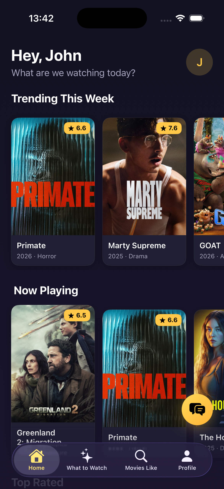
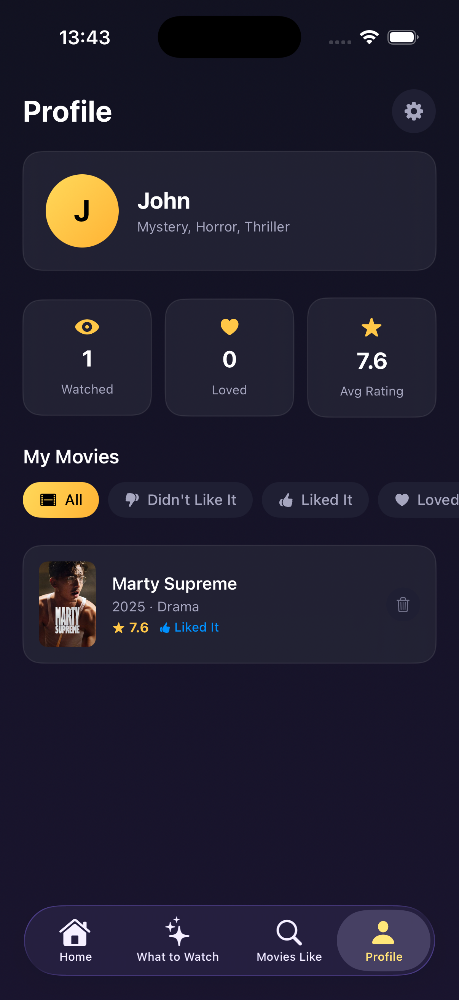

# CineFlow

CineFlow is an iOS app that helps you figure out what to watch. It connects to TMDB to pull in real movie data - trending titles, top rated films, what's playing in theaters, and upcoming releases. You see everything organized on a home feed you can scroll through and tap into for details, ratings, and overviews.

When you first open the app, it walks you through a short onboarding where you pick the genres and styles you're into. From there, the home screen tailors what it shows you based on those preferences. There's also a "What to Watch" section that narrows things down step by step if you're not sure what you're in the mood for.

The app keeps track of movies you've watched. You can rate them, mark whether you liked them or loved them, and see your stats on your profile - how many you've seen, your average rating, that kind of thing.

There's a built-in chat assistant called CineBot that runs on Ollama locally. You can ask it for recommendations, compare movies, or just talk about films. It runs entirely on your machine, no cloud APIs involved for the chat side.

<p align="center">
  
  
  
  
</p>

## Setup

Install Ollama from [ollama.com](https://ollama.com), then pull the model:

```
ollama pull llama3.2
```

Make sure Ollama is running before you use CineBot. If you want a different model, change `ollamaModel` in `APIConfig.swift`.

## Running

Open `CineFlow.xcodeproj` in Xcode, pick a simulator, and hit Run. The chat feature works best on Simulator since it can reach localhost on your Mac. For a physical device you'd need to point the Ollama URL to your Mac's local IP.

## Built with

SwiftUI, TMDB API, Ollama
