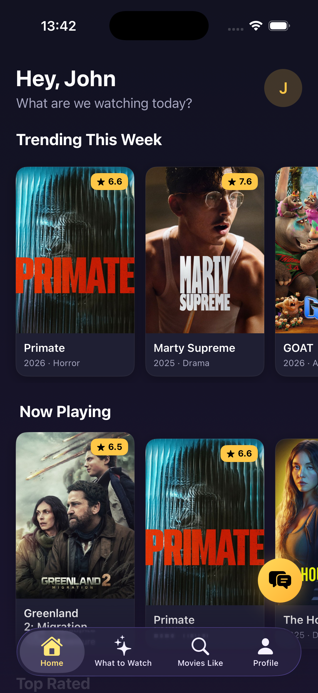
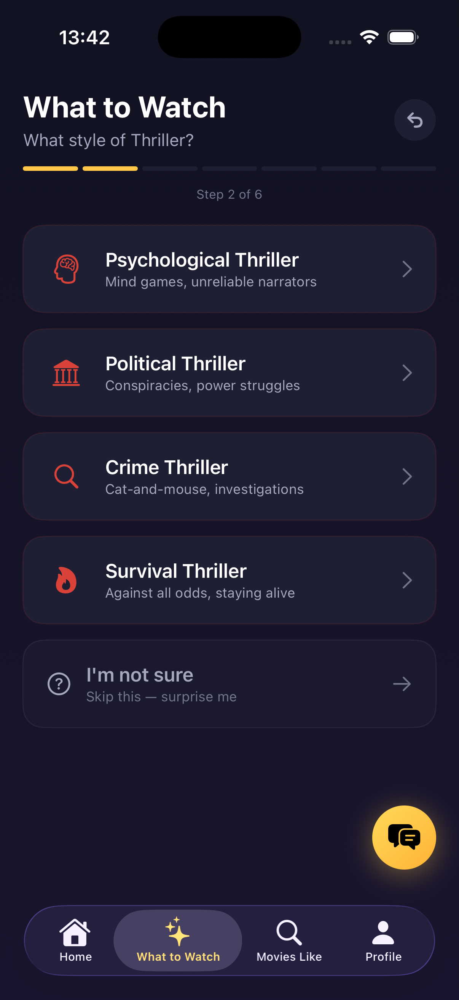
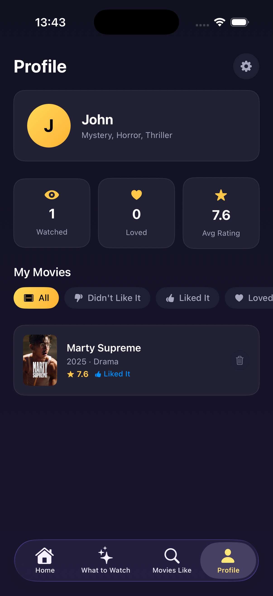
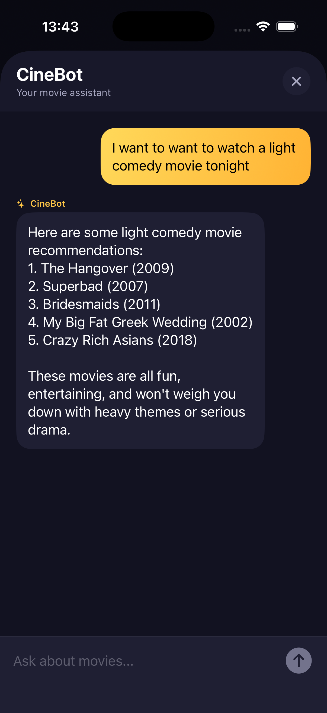
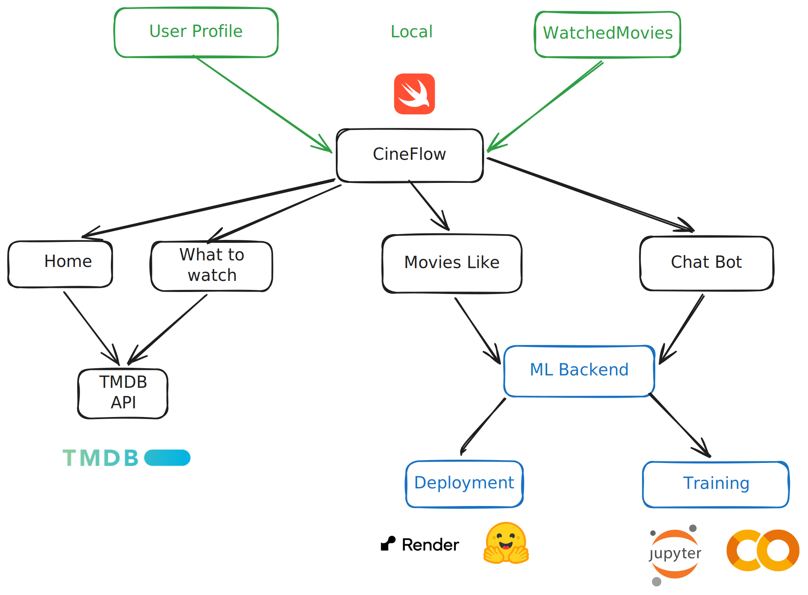

# CineFlow

CineFlow is a native iOS application for discovering and keeping track of movies. It pulls live data from the TMDB API -- trending titles, top rated films, what is currently playing in theaters, and upcoming releases -- and presents everything in a scrollable home feed. Tapping a movie opens its full detail page with ratings, synopsis, cast, and related content.

On first launch the app walks the user through a short onboarding flow where they select genres and styles they enjoy. The home screen then adapts to surface content that aligns with those preferences. A step-by-step "What to Watch" feature is available for moments when the user is not sure what they are in the mood for.

Movies the user has watched can be rated and marked as liked or loved. A profile section aggregates viewing history, average ratings, and total watch count.

There is also a built-in conversational assistant called CineBot. It is backed by a cloud-hosted large language model (currently served through Hugging Face Inference, though any OpenAI-compatible provider works). Users can ask CineBot for recommendations, compare movies, or just talk about film.

<p align="center">
  
  
  
  
</p>

---

## Table of Contents

1. [System Design](#system-design)
2. [Project Structure](#project-structure)
3. [iOS App Setup](#ios-app-setup)
4. [Backend Setup](#backend-setup)
5. [API Reference](#api-reference)
6. [Movie Recommendations](#movie-recommendations)
7. [CineBot Fine-Tuning](#cinebot-fine-tuning)
8. [Deployment](#deployment)
9. [Built With](#built-with)

---

## System Design

The system is split into two independently deployable parts: the iOS client and a lightweight Python API server. Each talks to external services as needed, and the two communicate over HTTP.



```
                             +------------------+
                             |    TMDB API      |
                             | (movie metadata, |
                             |  posters, etc.)  |
                             +--------+---------+
                                      |
                                      | HTTPS (direct)
                                      |
+-------------------+         +-------+--------+         +-------------------+
|                   |  HTTP   |                |  HTTPS  |                   |
|   iOS Client      +-------->+  FastAPI Server +-------->+  LLM Provider     |
|   (SwiftUI)       |         |  (ml-api)      |         |  (Hugging Face /  |
|                   +<--------+                +<--------+   OpenAI / any    |
|                   |         |                |         |   ) |
+-------------------+         +-------+--------+         +-------------------+
                                      |
                                      | internal
                                      |
                              +-------+--------+
                              |  Recommender   |
                              |  Engine        |
                              |  (ML model or  |
                              |   external API)|
                              +----------------+
```

**How data flows through the system:**

- **Browsing movies.** The iOS app talks directly to TMDB over HTTPS. No backend involvement.
- **Getting recommendations.** The iOS app sends a movie ID to the backend's `/recommend` endpoint. The backend runs the request through its recommender engine (either a local ML model or a call to an external recommendation API) and returns a ranked list of similar movies.
- **Chatting with CineBot.** The iOS app sends the user's message to `/chat` (or `/chat/stream` for real-time token streaming). The backend forwards the prompt to whichever LLM provider is configured (Hugging Face, OpenAI, Replicate, or any OpenAI-compatible service) and relays the response back.

The backend is stateless and horizontally scalable. It can run locally during development or be deployed to a managed platform like Render (see [Deployment](#deployment)).

---

## Project Structure

```
CineFlow/
|-- CineFlow/                        # iOS application (SwiftUI)
|   |-- Config/                      # API keys and endpoint configuration
|   |   |-- APIConfig.swift          # Base URLs, image helpers
|   |   +-- Secrets.swift            # TMDB API key (git-ignored)
|   |-- Models/                      # Data models and local persistence
|   |   |-- Movie.swift              # Core movie type
|   |   |-- Genre.swift              # Genre enum with TMDB mapping
|   |   |-- UserProfile.swift        # User preferences and stats
|   |   +-- WatchedMovieStore.swift   # Watch history storage
|   |-- Services/                    # Networking layer
|   |   |-- TMDBService.swift        # TMDB API client
|   |   |-- ChatService.swift        # CineBot chat client
|   |   +-- RecommendationService.swift  # ML recommendation client
|   |-- Views/                       # UI screens and components
|   |   |-- Home/                    # Home feed
|   |   |-- WhatToWatch/             # Step-by-step mood filter
|   |   |-- MoviesLike/              # "Movies like X" recommendations
|   |   |-- Chat/                    # CineBot conversation screen
|   |   |-- Profile/                 # User profile and stats
|   |   |-- Onboarding/              # First-launch genre picker
|   |   +-- Components/              # Shared UI pieces
|   +-- Theme/                       # Colors, typography, styling
|
+-- ml-api/                          # Python backend (FastAPI)
    |-- main.py                      # Application entry point, route definitions
    |-- recommender.py               # Movie recommendation engine
    |-- cloud_llm_service.py         # LLM provider abstraction (HF, OpenAI, Replicate)
    |-- models.py                    # Pydantic schemas for /recommend
    |-- chat_models.py               # Pydantic schemas for /chat
    |-- requirements.txt             # Python dependencies
    |-- start_backend.sh             # One-command server launcher
    |-- render.yaml                  # Render.com deployment config
    |-- Procfile                     # Process definition for cloud platforms
    +-- finetune/                    # Scripts to fine-tune a CineBot LLM
        |-- finetune_colab.ipynb     # Google Colab training notebook
        |-- generate_training_data.py
        +-- finetune_tinyllama.py
```

---

## iOS App Setup


**Connecting to the backend:**
- The app is currently configured to use the deployed Render backend:
  - `https://cineflow-gzxe.onrender.com`
- If you want local development instead, open `Config/APIConfig.swift` and switch `mlAPIBaseURL` to `http://localhost:8000` (Simulator) or your Mac's local IP (physical device, e.g. `http://192.168.1.42:8000`).

---

## Backend Setup

The backend lives in the `ml-api/` directory. Below are the steps to get it running from scratch.

### Prerequisites

- Python 3.11 or later
- pip (comes with Python)
- A Hugging Face API token (free, from https://huggingface.co/settings/tokens)

### Step-by-step installation

Open a terminal and run the following commands:

```bash
# 1. Move into the backend directory
cd ml-api

# 2. Create a Python virtual environment
python3 -m venv venv

# 3. Activate the virtual environment
source venv/bin/activate

# 4. Install all required packages
pip install -r requirements.txt
```

The `requirements.txt` installs the following:

| Package        | Purpose                                   |
|----------------|-------------------------------------------|
| fastapi        | Web framework for the API                 |
| uvicorn        | ASGI server to run FastAPI                |
| pydantic       | Request/response validation               |
| pandas         | Data manipulation (used by recommender)   |
| scikit-learn   | Machine learning utilities                |
| numpy          | Numerical computing                       |
| httpx          | Async HTTP client (calls to LLM APIs)     |
| python-dotenv  | Loads environment variables from `.env`   |

### Environment configuration

Create a `.env` file in `ml-api/` and fill in the required values:

```
LLM_PROVIDER=huggingface
LLM_MODEL=meta-llama/Llama-3.1-8B-Instruct
HF_API_TOKEN=hf_your_token_here
```

`LLM_PROVIDER` can be set to `huggingface`, `openai`, or `replicate` depending on which service you want to use. The backend will auto-detect the provider from whichever API token is present if you leave it set to `auto`.

### Starting the server

You have two options.

**Option A -- using the start script:**

```bash
chmod +x start_backend.sh
./start_backend.sh
```

The script automatically finds the correct Python interpreter, checks that dependencies are installed, and starts uvicorn on port 8000 with hot-reload enabled.

**Option B -- running uvicorn directly:**

```bash
uvicorn main:app --reload --port 8000
```

Once the server is running, open http://localhost:8000/docs in a browser to access the interactive API documentation (Swagger UI).

---

## API Reference

| Method | Endpoint                 | Description                                           |
|--------|--------------------------|-------------------------------------------------------|
| GET    | `/health`                | Returns service status, loaded models, LLM provider   |
| POST   | `/recommend`             | Accepts a TMDB movie ID; returns ranked recommendations |
| POST   | `/chat`                  | Send a message to CineBot; receive a single response  |
| POST   | `/chat/stream`           | Same as `/chat`, but streams tokens via SSE           |
| POST   | `/explain-recommendation`| Generates a natural-language explanation of why certain movies were recommended |

All request and response schemas are documented at the `/docs` endpoint when the server is running.

---

## Movie Recommendations

The recommendation engine is defined in `recommender.py`. In the current version it uses hardcoded sample data so that the full pipeline can be tested end to end without a trained model. To plug in a real model:

1. **Prepare a dataset.** Download movie metadata from TMDB or MovieLens (both are freely available on Kaggle).
2. **Train a model.** A content-based approach using TF-IDF on movie overviews and genres, with cosine similarity for ranking, is a solid starting point. Collaborative filtering is another option if you have user interaction data.
3. **Replace the placeholder.** Update `load_model()` to load your trained artifacts (e.g. a pickled similarity matrix or a saved scikit-learn pipeline) and update `predict()` to run inference against them.

Alternatively, the recommender can be swapped out entirely for calls to an external recommendation API. Because the `/recommend` endpoint is the only contract the iOS app depends on, anything that returns the expected JSON shape will work.

---

## CineBot Fine-Tuning

The `finetune/` directory contains everything needed to train a small language model on movie knowledge so it can serve as a more specialized CineBot. The recommended approach is Google Colab (free T4 GPU):

1. Open `finetune/finetune_colab.ipynb` in Google Colab.
2. Set your Hugging Face username in the configuration cell.
3. Run all cells. Training takes roughly 30 to 45 minutes on a free T4 instance.
4. The trained model is automatically pushed to your Hugging Face account.

After training, update your `.env`:

```
LLM_MODEL=your-username/cinebot-movie-expert
```

More details are available in `finetune/README.md`.

---

## Deployment

The backend is designed to be deployed to Render (or any similar platform). A `render.yaml` and a `Procfile` are included in the repository.

### Deploying to Render

1. Push your code to a GitHub repository.
2. In the Render dashboard, create a new Web Service and connect it to your repo.
3. Set the root directory to `ml-api`.
4. Render will pick up the `render.yaml` and configure the build and start commands automatically. If needed, set them manually:
   - Build command: `pip install -r requirements.txt`
   - Start command: `uvicorn main:app --host 0.0.0.0 --port $PORT`
   - Health check path: `/health`
5. In the Render environment settings, add the following variables:
   - `LLM_PROVIDER` -- `huggingface` (or your chosen provider)
   - `LLM_MODEL` -- the model ID (e.g. `meta-llama/Llama-3.1-8B-Instruct`)
   - `HF_API_TOKEN` -- your Hugging Face token
   - `ENVIRONMENT` -- `production`
   - `DEBUG` -- `false`
6. Deploy and verify:
   - `GET https://cineflow-gzxe.onrender.com/health`
   - `GET https://cineflow-gzxe.onrender.com/openapi.json`
7. Update `mlAPIBaseURL` in `Config/APIConfig.swift` to your Render URL (already set to `https://cineflow-gzxe.onrender.com` in this repo).

The free tier on Render works for development and demos, but it can cold-start after inactivity. The chat screen includes a built-in warm-up UX ("Waking up server, please wait...") while the backend comes online. For always-on behavior, use the $7/month "Starter" plan.
